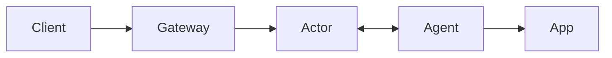

# Rivet Tunnels

> **Experimental:** This is an early prototype. It buffers HTTP bodies in memory, has no availability guarantees, and is not ready for production traffic.

Expose a local app through a public URL backed by a Rivet Actor:

```bash
npx @rivet-labs/tunnel --endpoint http://127.0.0.1:3000
# https://quietriver.tunnels.example.com/
```

## Architecture



- **Client:** Browser, webhook, or API caller using the public URL.
- **Gateway:** Public wildcard endpoint that routes a hostname to its actor.
- **Actor:** Rivet Actor coordinating one tunnel.
- **Agent:** Local tunnel CLI connected to the actor over WebSocket.
- **App:** Local service being exposed.

Each agent creates an actor with a random tunnel name and keeps a WebSocket open to it. The gateway extracts the tunnel name from the subdomain and routes each client request through the actor to the agent and app.

## Run locally

```bash
# Terminal 1: tunnel actor + local Rivet engine
RIVETKIT_ENGINE_AUTO_DOWNLOAD=1 cargo run --bin rivet-tunnel-actor -- --host 0.0.0.0

# Terminal 2: tunnel gateway
cargo run --bin rivet-tunnel-gateway -- --listen 0.0.0.0:8080

# Terminal 3: connect an agent to the local app
cargo run --bin rivet-tunnel -- --endpoint http://127.0.0.1:3000
```

For a hosted deployment, point `*.tunnels.gameinc.io` at the gateway and configure `RIVET_ENDPOINT`, `RIVET_NAMESPACE`, `RIVET_TOKEN`, `RIVET_POOL_NAME`, `RIVET_TUNNEL_BASE_DOMAIN`, and `RIVET_TUNNEL_PUBLIC_BASE_URL`. The wildcard only selects the actor; the gateway keeps the Rivet token private and performs the host-to-actor rewrite.

## Current limits

HTTP only, one active agent per tunnel, 8 MiB buffered request and response bodies, and a 60-second response timeout.
