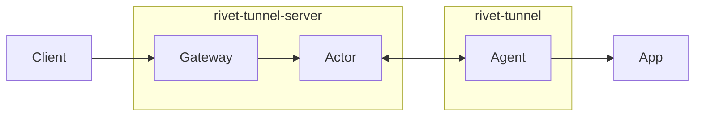

# Rivet Tunnels

> **Experimental:** This is an early prototype with no availability guarantees. Do not use it for production traffic.

Expose a local HTTP server through a public URL backed by a Rivet Actor:

```bash
npx @rivet-labs/tunnel --endpoint http://127.0.0.1:3000
# https://quietriver.example.com/
```

The npm package and hosted gateway are not available yet. Use the local setup below to try it today.

## Architecture



- **Client:** Browser, webhook, or API caller using the public URL.
- **Gateway:** Public wildcard endpoint that routes a hostname to its actor.
- **Actor:** Rivet Actor coordinating one tunnel.
- **Agent:** Local tunnel CLI connected to the actor over WebSocket.
- **App:** Local HTTP server being exposed.

The agent creates an actor with a random tunnel name. The gateway reads that name from the request hostname and sends the request through the actor to the agent and local app.

## Local setup

**Step 1: Start a local app**

```bash
python3 -m http.server 3000 --bind 0.0.0.0
```

**Step 2: Start the tunnel server**


The server runs both the gateway and the Rivet Actor. It also downloads and starts a local Rivet engine.

```bash
cargo run --bin rivet-tunnel-server -- --engine-auto-download --host 0.0.0.0
```

**Step 3: Open a tunnel**

```bash
cargo run --bin rivet-tunnel -- --endpoint http://127.0.0.1:3000
```

**Step 4: Send a request**

Replace `<tunnel-name>` with the name printed by the agent:

```bash
curl --resolve "<tunnel-name>.localhost:8080:127.0.0.1" \
  "http://<tunnel-name>.localhost:8080"
```

## Production deployment

**Step 1: Get a Rivet endpoint**

Get an endpoint from [Rivet Cloud](https://rivet.dev) or a self-hosted Rivet deployment.

**Step 2: Build the tunnel server**

Build the included `Dockerfile`. The resulting image contains the single server that handles both Rivet Actor requests and public tunnel traffic.

```bash
docker build -t rivet-tunnel-server .
```

**Step 3: Deploy the tunnel server**

Deploy the image with these environment variables:

```bash
rivet-tunnel-server \
  --runtime-mode serverless \
  --rivet "<endpoint>" \
  --base-domain example.com
```

Register `https://<server>/api/rivet` as the serverless actor runner for the endpoint.

**Step 4: Configure wildcard DNS**

Point `*.example.com` at the server. Your proxy or load balancer must preserve the original `Host` header.

**Step 5: Open a tunnel**

Run the agent with the same Rivet endpoint and the public base URL.

```bash
rivet-tunnel \
  --rivet "<endpoint>" \
  --gateway https://example.com \
  --endpoint http://127.0.0.1:3000
```

## Limits

HTTP only, one active agent per tunnel, 8 MiB buffered request and response bodies, and a 60-second response timeout.

## License

Copyright Rivet Gaming, LLC. All rights reserved.
