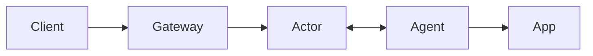

# Rivet Tunnels

> **Experimental:** This is an early prototype. It buffers HTTP bodies in memory, has no availability guarantees, and is not ready for production traffic.

Expose a local app through a public URL backed by a Rivet Actor:

```bash
npx @rivet-labs/tunnel --endpoint http://127.0.0.1:3000
# https://quietriver.tunnels.example.com/
```

The npm package and public gateway are not deployed yet. The command above is the intended hosted experience; use the local setup below today.

## Architecture



- **Client:** Browser, webhook, or API caller using the public URL.
- **Gateway:** Public wildcard endpoint that routes a hostname to its actor.
- **Actor:** Rivet Actor coordinating one tunnel.
- **Agent:** Local tunnel CLI connected to the actor over WebSocket.
- **App:** Local service being exposed.

Each agent creates an actor with a random tunnel name and keeps a WebSocket open to it. The gateway extracts the tunnel name from the subdomain and routes each client request through the actor to the agent and app.

## Local setup

Clone the repository, then run these four processes from its root. The example app requires Python 3; the first actor command downloads and starts a local Rivet engine.

```bash
# Terminal 1: example app
python3 -m http.server 3000 --bind 0.0.0.0

# Terminal 2: tunnel actor + local Rivet engine
RIVETKIT_ENGINE_AUTO_DOWNLOAD=1 cargo run --bin rivet-tunnel-actor -- --host 0.0.0.0

# Terminal 3: tunnel gateway
cargo run --bin rivet-tunnel-gateway -- --listen 0.0.0.0:8080

# Terminal 4: connect an agent to the app
cargo run --bin rivet-tunnel -- --endpoint http://127.0.0.1:3000
# Prints: http://<tunnel-name>.localhost:8080/
```

Open the printed URL in a browser. For a deterministic smoke test, replace `quietriver` with the printed tunnel name:

```bash
TUNNEL_NAME=quietriver
curl --fail --silent --show-error \
  --resolve "$TUNNEL_NAME.localhost:8080:127.0.0.1" \
  "http://$TUNNEL_NAME.localhost:8080/README.md" \
  | cmp - README.md
```

`cmp` exits successfully without output when the response traveled through the gateway, actor, and agent and matches the file served by the app.

## Cloud Run actor backend

The included `Dockerfile` runs the actor in RivetKit's serverless mode. Deploy it with one actor request per instance and scale-to-zero enabled:

```bash
gcloud run deploy rivet-tunnels \
  --project <gcp-project> \
  --region us-west1 \
  --source . \
  --allow-unauthenticated \
  --min-instances 0 \
  --max-instances 20 \
  --concurrency 1 \
  --timeout 3600 \
  --port 8080
```

Configure the Rivet namespace's serverless runner URL as `https://<cloud-run-host>/api/rivet`, with a request lifespan below Cloud Run's timeout. The public gateway is a separate deployment.

## Rivet Cloud routing

The actor and agent can use Rivet Cloud through the `RIVET_ENDPOINT` copied from the Rivet dashboard. The public wildcard must terminate at the tunnel gateway—not directly at `api.rivet.dev`:

```text
*.tunnels.example.com → tunnel gateway → api.rivet.dev/gateway/...
```

The gateway reads the public hostname to select the tunnel, then creates a new request to `RIVET_ENDPOINT`. It intentionally does not forward the original `Host` header, so Rivet Cloud receives its expected hostname and routes the request by the `/gateway/...` path.

If the platform hosting the gateway requires a fixed hostname for its own routing, put an edge proxy in front of it or perform the hostname-to-actor rewrite at the edge. Pointing the wildcard directly at a fixed-host deployment will not preserve both routing requirements by itself.

Configure `RIVET_ENDPOINT`, `RIVET_POOL_NAME`, `RIVET_TUNNEL_BASE_DOMAIN`, and `RIVET_TUNNEL_PUBLIC_BASE_URL`. Alternatively, use `RIVET_NAMESPACE` and `RIVET_TOKEN` when the endpoint does not contain URL credentials.

## Current limits

HTTP only, one active agent per tunnel, 8 MiB buffered request and response bodies, and a 60-second response timeout.
