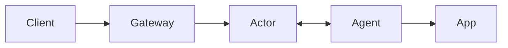

# Rivet Tunnels

> **Experimental:** This is an early prototype with no availability guarantees. Do not use it for production traffic.

Expose a local HTTP server through a public URL backed by a Rivet Actor:

```bash
npx @rivet-labs/tunnel --endpoint http://127.0.0.1:3000
# https://quietriver.example.com/
```

The npm package and hosted gateway are not available yet. Use the local setup below to try it today.

## Architecture



- **Client:** Browser, webhook, or API caller using the public URL.
- **Gateway:** Public wildcard endpoint that routes a hostname to its actor.
- **Actor:** Rivet Actor coordinating one tunnel.
- **Agent:** Local tunnel CLI connected to the actor over WebSocket.
- **App:** Local HTTP server being exposed.

The agent creates an actor with a random tunnel name. The gateway reads that name from the request hostname and sends the request through the actor to the agent and local app.

## Local setup

Run these four processes from the repository root:

```bash
# 1. Start an example app.
python3 -m http.server 3000 --bind 0.0.0.0

# 2. Start the actor and a local Rivet engine.
RIVETKIT_ENGINE_AUTO_DOWNLOAD=1 cargo run --bin rivet-tunnel-actor -- --host 0.0.0.0

# 3. Start the public gateway.
cargo run --bin rivet-tunnel-gateway -- --listen 0.0.0.0:8080

# 4. Open the tunnel.
cargo run --bin rivet-tunnel -- --endpoint http://127.0.0.1:3000
```

Open the printed `http://<tunnel-name>.localhost:8080` URL.

## Production deployment

1. Get a Rivet endpoint from [Rivet Cloud](https://rivet.dev) or a self-hosted Rivet deployment.
2. Deploy `rivet-tunnel-actor` and register its `/api/rivet` route as the serverless actor runner for that endpoint.
3. Deploy `rivet-tunnel-gateway` with `RIVET_ENDPOINT` and `RIVET_TUNNEL_BASE_DOMAIN`, then point wildcard DNS for the base domain at the gateway. The gateway must receive the original `Host` header.
4. Run the agent with the same `RIVET_ENDPOINT` and set `RIVET_TUNNEL_PUBLIC_BASE_URL` to the public base URL.

## Limits

HTTP only, one active agent per tunnel, 8 MiB buffered request and response bodies, and a 60-second response timeout.

## License

Copyright Rivet Gaming, LLC. All rights reserved.
